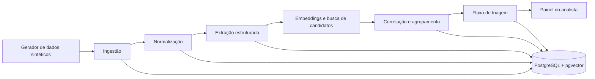

# Arquitetura

## Visão e princípio

O VBE Hub será um monólito modular: uma aplicação implantável, com módulos internos independentes e contratos explícitos. Essa escolha reduz a complexidade de operação até a validação e preserva pontos de extensão para conectores e provedores de IA futuros.



## Camadas e módulos

| Camada | Módulos | Responsabilidade |
| --- | --- | --- |
| Interface | painel, mapa, detalhe do sinal | Explicar evidências e capturar decisão humana. |
| API | registros, sinais, revisões, métricas | Expor dados ao painel e coordenar casos de uso. |
| Domínio | normalização, triagem, correlação, agrupamento, prioridade | Aplicar regras sem depender de web, banco ou provedor de IA. |
| Processamento | gerador, extração, embeddings, lote | Executar tarefas demoradas fora da requisição web. |
| Adapters | PostgreSQL, Gemini, Ollama, EIOS futuro, GdS futuro | Isolar dependências externas. |

## Stack proposta

- Backend: Python e FastAPI.
- Processamento em lote: Celery e Redis; o uso pode começar síncrono para o primeiro experimento pequeno e migrar antes do lote massivo.
- Persistência: PostgreSQL com extensão `pgvector`, SQLAlchemy 2.x nos adapters e Alembic para migrations.
- Frontend: Next.js/React e Leaflet para mapa, após o núcleo analítico estar demonstrado.
- Execução local: Docker Compose.

## Docker como fronteira operacional

Docker Compose é o contrato oficial entre a aplicação e o dispositivo de validação. O fluxo suportado não pressupõe runtimes ou bancos instalados diretamente no host.

Na etapa 1, a composição contém:

```text
api ───────────────► postgres + pgvector
 │                         ▲
 └──────────────────► redis
generator/importer ────────┘
```

- `api`: imagem do backend FastAPI, também usada para comandos de migrations, testes e utilitários quando adequado;
- `postgres`: banco com versão fixada e extensão pgvector habilitada;
- `redis`: infraestrutura preparada para filas e cache posteriores;
- `generator/importer`: comando ou serviço de execução finita que gera e importa dados sintéticos sem exigir Python no host.

Frontend e worker serão incorporados à mesma composição em seus milestones. A composição final deve ser inicializada por um comando documentado e oferecer dois modos:

- desenvolvimento: volumes de código e recarga automática, sem comprometer o caminho reproduzível;
- validação/demonstração: imagens construídas, dataset e semente identificados, sem dependência do ambiente do desenvolvedor.

### Invariantes operacionais

- Imagens-base usam versões explícitas; não usar tags flutuantes como `latest`.
- Serviços possuem health checks e dependências condicionadas a prontidão, não apenas ordem de inicialização.
- Migrations são executadas por comando idempotente e falham visivelmente.
- Segredos entram apenas por variáveis/arquivos ignorados; não são incorporados às imagens.
- Volumes nomeados, portas, comandos de reset e consequências de limpeza são documentados.
- Testes e lint possuem comandos em contêiner equivalentes aos checks da CI.
- O modo de validação pode operar com provider falso ou resultado previamente gerado quando a API externa não estiver disponível, deixando essa condição explícita.

## IA: decisão operacional

O domínio depende de interfaces `StructuredExtractor`, `EmbeddingProvider` e `RelationJudge`, não de Gemini ou Ollama diretamente.

- Padrão para validação: Gemini, com saída JSON estruturada e embeddings multilíngues.
- Alternativa local: Ollama para experimentos, testes offline e comparação de custo/latência.
- Não usar LLM para comparar todos os pares: a busca vetorial e filtros temporal/geográfico geram candidatos; a IA julga somente os candidatos promissores.
- Toda resposta de IA deve registrar modelo, versão do prompt, entrada resumida, saída validada, tempo, erro e decisão humana posterior.

Uma GTX 1650 de 4 GB suporta experimentação com modelos pequenos quantizados e embeddings, mas não deve ser a única estratégia para a extração clínica multilíngue em grande lote. A qualidade será medida, não presumida.

## Fluxo de estado

`detectado → em_triagem → em_verificacao → avaliacao_de_risco → encerrado`

Um sinal pode ser descartado durante a triagem ou verificação, com motivo e autor da decisão. A prioridade da IA é apenas uma sugestão, distinta do resultado da avaliação de risco.

## Fontes futuras e dados sintéticos

O EIOS trabalha com inteligência de fontes abertas e notícias em múltiplas fontes/idiomas. O Guardiões da Saúde é uma plataforma de vigilância participativa, cujos reportes são compilados para análise de sintomas e doenças. Os contratos sintéticos refletem essas características, mas serão revisados antes de qualquer conector real, pois os endpoints, permissões e campos disponíveis precisam de confirmação com cada provedor.

Fontes: [WHO EIOS](https://www.who.int/initiatives/eios), [ProEpi Guardiões da Saúde](https://proepi.org.br/guardians-of-health/), [documentação de saída estruturada Gemini](https://ai.google.dev/gemini-api/docs/structured-output) e [documentação de embeddings Gemini](https://ai.google.dev/gemini-api/docs/embeddings).
