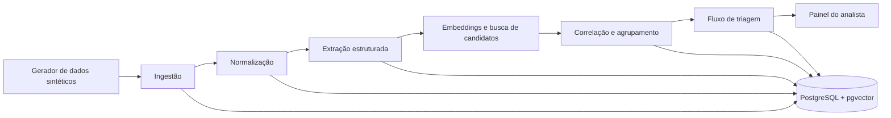

# Arquitetura

## Visão e princípio

O VBE Hub será um monólito modular: uma aplicação implantável, com módulos internos independentes e contratos explícitos. Essa escolha reduz a complexidade de operação até a validação e preserva pontos de extensão para conectores e provedores de IA futuros.



## Camadas e módulos

| Camada | Módulos | Responsabilidade |
| --- | --- | --- |
| Interface | painel, mapa, detalhe do sinal | Explicar evidências e capturar decisão humana. |
| API | registros, sinais, revisões, métricas | Expor dados ao painel e coordenar casos de uso. |
| Domínio | normalização, triagem, correlação, agrupamento, prioridade | Aplicar regras sem depender de web, banco ou provedor de IA. |
| Processamento | gerador, extração, embeddings, lote | Executar tarefas demoradas fora da requisição web. |
| Adapters | PostgreSQL, Gemini, Ollama, EIOS futuro, GdS futuro | Isolar dependências externas. |

## Stack proposta

- Backend: Python e FastAPI.
- Processamento em lote: Celery e Redis; o uso pode começar síncrono para o primeiro experimento pequeno e migrar antes do lote massivo.
- Persistência: PostgreSQL com extensão `pgvector`, SQLAlchemy 2.x nos adapters e Alembic para migrations.
- Frontend: Next.js/React em `frontend/`; a fundação visual já é executável. Leaflet será adicionado
  pelo adaptador de mapa quando a visualização territorial agregada for integrada.
- Execução local: Docker Compose.

## Docker como fronteira operacional

Docker Compose é o contrato oficial entre a aplicação e o dispositivo de validação. O fluxo suportado não pressupõe runtimes ou bancos instalados diretamente no host.

Na composição atual, os serviços de aplicação são:

```text
frontend ────────► api ────────► postgres + pgvector
                       │                 ▲
                       └────────► redis
generator/importer ──────────────────────┘
```

- `api`: imagem do backend FastAPI, também usada para comandos de migrations, testes e utilitários quando adequado;
- `frontend`: imagem Next.js não privilegiada, com health check próprio e configuração pública da
  URL da API sem segredos;
- `postgres`: banco com versão fixada e extensão pgvector habilitada;
- `redis`: infraestrutura preparada para filas e cache posteriores;
- `generator/importer`: comando ou serviço de execução finita que gera e importa dados sintéticos sem exigir Python no host.

O worker será incorporado à mesma composição em seu milestone. A composição deve ser inicializada
por um comando documentado e oferecer dois modos:

- desenvolvimento: volumes de código e recarga automática, sem comprometer o caminho reproduzível;
- validação/demonstração: imagens construídas, dataset e semente identificados, sem dependência do ambiente do desenvolvedor.

## Painel do analista: plano de integração

O protótipo exploratório da interface estabeleceu a linguagem visual e os três percursos da fundação
agora versionada em `frontend/`. A fundação usa seus dados mockados para demonstração visual, mas
ainda não substitui os contratos da API nem consulta dados persistidos:

1. **Triagem**: fila filtrável e paginada de sinais, ordenada por prioridade sugerida e atualizada
   por leitura da API.
2. **Investigação**: detalhe de um sinal com resumo consolidado, evidências de origem, fichas
   técnicas, critérios de agrupamento, trilha de auditoria e painel de decisão humana.
3. **Panorama**: leitura operacional e territorial agregada, com ligação para a fila filtrada.

Os componentes devem preservar divulgação progressiva de informação. O item compacto da fila
mostra código, prioridade sugerida, estado, condição/sintomas-chave, local/período e composição de
fontes. Justificativa, divergências, campos ausentes, fichas técnicas e texto de origem pertencem
ao detalhe ou à expansão explícita; a fila não deve esconder a origem nem apresentar todo o volume
de evidências de uma vez.

### Visualizações de fluxo

A tabela/fila é a visão principal porque permite comparar prioridade, filtros e evidências de
forma densa. Uma visão Kanban é complementar: organiza os mesmos sinais por `triagem`,
`verificação`, `avaliação de risco` e `encerrado` para revelar volume e gargalos. Ela não confirma
eventos e não pode permitir arrastar um cartão para alterar estado sem abrir a decisão humana,
validar a transição no backend e registrar o evento de auditoria.

### Visualização geoespacial

O mapa exibirá somente localização consolidada e agregada por bairro ou outra unidade
administrativa aprovada para a demonstração. Não exibirá coordenada de relato individual,
endereço, identificação da pessoa ou inferência de localização precisa. Marcadores ou polígonos
apresentarão contagem de sinais, estado predominante, prioridade sugerida e composição de fontes;
selecionar uma área filtrará ou encaminhará para a fila correspondente.

Leaflet será encapsulado em um adaptador de mapa. Para manter a demonstração reproduzível sem
Internet, a primeira versão usará geometria e dados de demonstração versionados/localmente
servidos; tiles externos serão opcionais e nunca requisito de validação. Estados de mapa sem dados,
geometria indisponível e filtro sem resultado devem ser compreensíveis sem depender do mapa-base.

### Contratos de integração previstos

O frontend não acessa tabelas do banco diretamente. A API expõe, com paginação, filtros e
versões explícitas quando aplicável:

- fila de sinais com campos de leitura rápida e contagem de fontes por tipo, disponível em
  `GET /signals`;
- detalhe do sinal, evidências vinculadas, fichas técnicas, justificativa, divergências e auditoria,
  disponível em `GET /signals/{signal_id}`; consulte o [contrato de leitura](signal-read-api.md);
- resumo geoespacial agregado por área, sem registros individualizados;
- resumo operacional para indicadores e panorama;
- comando de revisão humana que aplica a máquina de estados e retorna o evento de auditoria.

A interface tratará indisponibilidade, carregamento, resposta vazia e conflito de versão sem
inventar dados ou concluir decisão sanitária. Dados sintéticos permanecem visualmente marcados em
todas as telas da PoC.

### Invariantes operacionais

- Imagens-base usam versões explícitas; não usar tags flutuantes como `latest`.
- Serviços possuem health checks e dependências condicionadas a prontidão, não apenas ordem de inicialização.
- Migrations são executadas por comando idempotente e falham visivelmente.
- Segredos entram apenas por variáveis/arquivos ignorados; não são incorporados às imagens.
- Volumes nomeados, portas, comandos de reset e consequências de limpeza são documentados.
- Testes e lint possuem comandos em contêiner equivalentes aos checks da CI.
- O modo de validação pode operar com provider falso ou resultado previamente gerado quando a API externa não estiver disponível, deixando essa condição explícita.

## IA: decisão operacional

A camada de aplicação depende das portas `StructuredExtractor`, `EmbeddingProvider` e `RelationJudge`; domínio e aplicação não dependem de Gemini ou Ollama diretamente.

- Padrão para validação: Gemini, com saída JSON estruturada e embeddings multilíngues.
- Alternativa local: Ollama para experimentos, testes offline e comparação de custo/latência.
- Não usar LLM para comparar todos os pares: a busca vetorial e filtros temporal/geográfico geram candidatos; a IA julga somente os candidatos promissores.
- Toda resposta de IA deve registrar modelo, versão do prompt, entrada resumida, saída validada, tempo, erro e decisão humana posterior.

Uma GTX 1650 de 4 GB suporta experimentação com modelos pequenos quantizados e embeddings, mas não deve ser a única estratégia para a extração clínica multilíngue em grande lote. A qualidade será medida, não presumida.

## Consolidação auditável

O módulo de consolidação consome fichas e relações já classificadas, sem nova chamada ao modelo de
IA. Relações fortes formam componentes apenas quando não há conflitos geográfico, clínico ou
temporal; relações contextuais são anexadas sem unir componentes independentes. Os campos
consolidados mantêm proveniência e divergências, e a política versionada torna o reprocessamento
idempotente sem apagar resultados anteriores. Consulte o [contrato de
consolidação](signal-consolidation.md) e a [ADR-006](decisions/ADR-006-versioned-signal-consolidation.md).

A prioridade sugerida é calculada depois da consolidação, sem LLM, por pesos e faixas versionados.
Score, confiança dos dados e futura avaliação humana são conceitos e contratos diferentes. Cada
componente aponta para evidências de origem e campos desconhecidos permanecem explícitos. Consulte
o [contrato de prioridade](suggested-priority.md) e a
[ADR-007](decisions/ADR-007-rules-based-suggested-priority.md).

## Fluxo de estado

`detected → triage → verification → risk_assessment → closed`

O fluxo é uma máquina `workflow-v1` com transições explícitas, versão otimista e eventos
imutáveis. Um sinal pode ser encerrado durante triagem, verificação ou avaliação de risco, sempre
com motivo e ator. Aceitação, correção e rejeição de sugestões preservam valor anterior, novo valor
e vínculo com a origem. A prioridade automática continua sendo sugestão, distinta do resultado da
avaliação de risco. Consulte o [contrato de revisão humana](human-review-workflow.md) e a
[ADR-008](decisions/ADR-008-append-only-human-review.md).

## Fontes futuras e dados sintéticos

O EIOS trabalha com inteligência de fontes abertas e notícias em múltiplas fontes/idiomas. O Guardiões da Saúde é uma plataforma de vigilância participativa, cujos reportes são compilados para análise de sintomas e doenças. Os contratos sintéticos refletem essas características, mas serão revisados antes de qualquer conector real, pois os endpoints, permissões e campos disponíveis precisam de confirmação com cada provedor.

Fontes: [WHO EIOS](https://www.who.int/initiatives/eios), [ProEpi Guardiões da Saúde](https://proepi.org.br/guardians-of-health/), [documentação de saída estruturada Gemini](https://ai.google.dev/gemini-api/docs/structured-output) e [documentação de embeddings Gemini](https://ai.google.dev/gemini-api/docs/embeddings).
