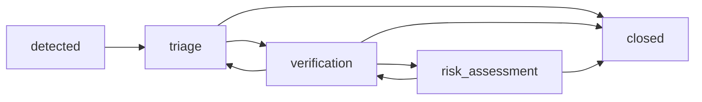

# Revisão humana e trilha de auditoria

## Finalidade e limite

O fluxo permite que um analista aceite, corrija ou rejeite sugestões de relação, pertencimento,
agrupamento e prioridade. A ação humana fica separada do resultado automático e não confirma um
evento de saúde pública. Nesta PoC, o ator é uma identidade sintética configurada no servidor; não
há autenticação, autorização ou integração com diretório institucional.

## Estados e transições

A máquina `workflow-v1` usa os valores abaixo. Somente as setas declaradas são aceitas.



O encerramento exige um motivo estruturado: `duplicate`, `insufficient_evidence`,
`not_public_health_event`, `resolved` ou `other`. Um sinal encerrado não pode ser reaberto em
`workflow-v1`; uma política futura deverá receber outra versão.

## Revisões

Cada revisão aponta para o identificador do objeto e para a identidade imutável da sugestão. O
servidor confirma que o alvo pertence ao sinal antes de registrar a decisão.

| Campo | Valores ou regra |
| --- | --- |
| `target_type` | `relation`, `membership`, `grouping` ou `priority` |
| `action` | `accept`, `correct` ou `reject` |
| `corrected_value` | Obrigatório em `correct`; até 20 campos escalares limitados |
| `reason_code` | Obrigatório em `correct` e `reject` |
| `comment` | Contexto opcional de até 500 caracteres |

Uma nova sugestão, com outra identidade, não apaga a decisão anterior. Uma correção também não
altera eventos já gravados: ela cria um novo evento compensatório cujo `previous_value` referencia
a decisão vigente e cujo `new_value` registra o novo entendimento.

## Concorrência, repetição e auditoria

O cliente envia `expected_version`. Se outro analista já alterou o fluxo, a API responde `409` com
`workflow_version_conflict`, evitando sobrescrita silenciosa. Cada escrita também exige uma
`operation_key`:

- repetir a mesma chave com conteúdo idêntico retorna o evento já criado;
- reutilizar a chave com conteúdo diferente retorna `operation_key_conflict`;
- uma impressão SHA-256 do conteúdo canônico comprova a equivalência da repetição.

Os eventos preservam ator, instante, versão, ação, alvo, valor anterior, valor novo, motivo e
comentário. A tabela `review_events` aceita somente inserções; um gatilho do PostgreSQL rejeita
alterações e exclusões. O vínculo com o sinal e suas evidências de origem permanece intacto.

## API

| Método e caminho | Finalidade |
| --- | --- |
| `GET /signals/{signal_id}/workflow` | Consultar estado e versão correntes. |
| `POST /signals/{signal_id}/workflow/transitions` | Avançar, retornar ou encerrar conforme a máquina. |
| `POST /signals/{signal_id}/reviews` | Registrar decisão sobre uma sugestão. |
| `GET /signals/{signal_id}/audit-events` | Consultar o histórico em ordem. |

Exemplo de transição para triagem:

```json
{
  "operation_key": "triage-0001",
  "expected_version": 0,
  "target_state": "triage",
  "comment": "Sinal sintético encaminhado para análise."
}
```

Exemplo de aceitação de agrupamento, usando a `identity_key` retornada pelo sinal:

```json
{
  "operation_key": "review-grouping-0001",
  "expected_version": 1,
  "target_type": "grouping",
  "target_id": "00000000-0000-0000-0000-000000000001",
  "suggestion_identity_key": "HASH_SHA256_DA_SUGESTAO",
  "action": "accept",
  "comment": "As evidências sintéticas tratam do mesmo evento provável."
}
```

O ator não é aceito no corpo da requisição. Configure `REVIEW_ACTOR_ID` no `.env`; o valor padrão
é `synthetic-analyst`. Isso facilita a demonstração reproduzível, mas não identifica uma pessoa
real. A API não deve ser exposta fora do ambiente local até autenticação e autorização serem
implementadas.

## Uso no painel demonstrativo

Na ficha do sinal, o analista escolhe explicitamente a sugestão de agrupamento ou prioridade e a
ação de aceitar, corrigir ou rejeitar. Correção e rejeição exigem motivo estruturado; correção
também exige campo e valor propostos. A mudança de etapa usa as transições declaradas acima e o
encerramento exige motivo. Antes da submissão, o painel pede confirmação.

Cada submissão gera uma `operation_key` e desabilita novos envios enquanto estiver pendente. A
resposta bem-sucedida atualiza imediatamente estado, versão, data e histórico exibidos. Em `409`,
o painel explica a concorrência e permite recarregar os dados canônicos sem apagar o formulário.
O navegador fala apenas com rotas do Next; elas não aceitam nem encaminham a identidade do ator.

## Erros esperados

- `404 workflow_signal_not_found`: sinal inexistente;
- `409 invalid_workflow_transition`: transição não permitida;
- `409 workflow_version_conflict`: versão concorrente;
- `422 operation_key_conflict`: chave reutilizada com outro conteúdo;
- `422 review_target_not_found`: alvo não pertence ao sinal ou à versão indicada;
- `422 closure_reason_required` ou `reason_code_required`: justificativa obrigatória ausente.

